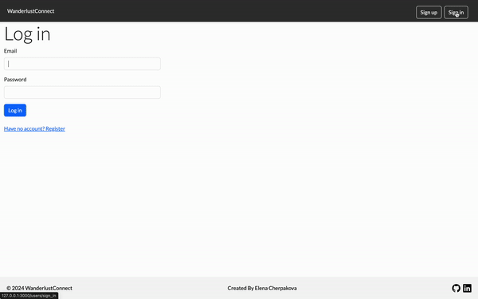
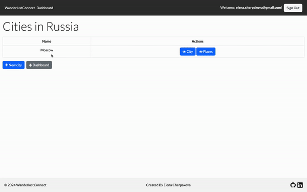
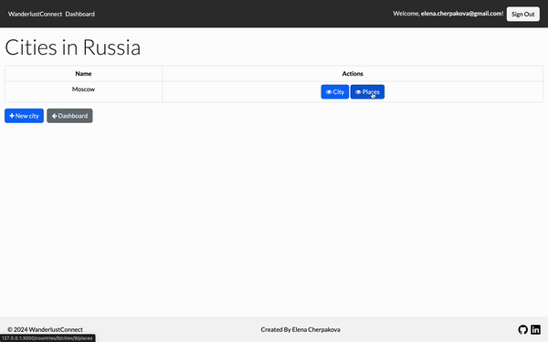
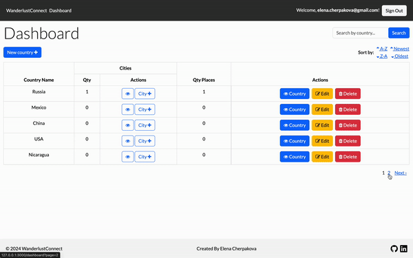

# Wanderlust Connect 🌏 

Wanderlust Connect: Where your travel dreams take flight. Seamlessly create countries, cities, and places with ratings and comments. Explore the world, share your experiences, and plan your next adventure with ease.

## Link:
https://wanderlust-connect.onrender.com

## Features

- 📝 User Registration and Authentication: Securely register accounts and log in to access personal travel records.
- ➕ Adding Travel Entries: Easily add countries, cities, and places with ratings and comments.
- ✏️ Editing Travel Entries: Edit travel details including country names, city names, place details, ratings, and comments.
- 🗑️ Deleting Travel Entries: Remove entries to keep records relevant.
- 🔍 Search and Filter: Quickly find entries and apply filters based on name and category.
- 📄 Pagination: Navigate travel records effortlessly with pagination.

## Screenshots 
#### Landing page

#### Create | Edit Country

#### Create | Edit city

#### Create | Update place

#### Pagination | Filtration

## Tech Stack 🛠️

- Ruby on Rails v3.2.1
- ElephantSQL (for PostgreSQL databases)
- Devise v4.9 (for authentication)
- Bootstrap v5.3 (for front-end styling)

## Installation 🚀
1. Clone the repository: `git clone [repository-url]`
2. Navigate to the project directory in your terminal.
3. Run `bundle install` to install the necessary Ruby gems.
4. Set up your database by running `rails db:create` and `rails db:migrate`.
5. Start the Rails server with `rails server`.
6. Visit `localhost:3000` in your web browser to access Wanderlust Connect.
7. Begin your journey by creating countries, cities, and places, and share your travel experiences with ratings and comments."

## Contributing 🤝

Contributions to the Wanderlust Connect project are welcome! If you find any issues or have suggestions for improvements, please feel free to submit a pull request or open an issue.

## License 📄

The Wanderlust Connect project is released under the [MIT License](LICENSE).